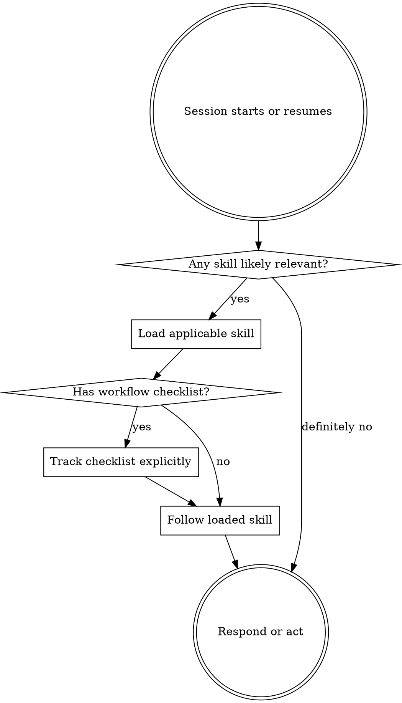

# Using Superpowers

## W-Question, Evidence, and Handoff Gate

When this workflow creates, reviews, executes, verifies, delegates, completes, or hands off durable work, apply `../../../references/w-question-evidence-standard.md` proportionally before the next irreversible or hard-to-review step. Capture the relevant wer, was, wann, wo, wie, womit, wovon, wogegen, warum/wieso/weshalb, and welche evidence in the saved artifact, review, checkpoint, or final report.

Use an Evidence Ledger, Session Evidence, Decision Ledger, Autonomy Contract, Stop Conditions, and Validation Evidence when prior sessions, handovers, reviews, branches, worktrees, tools, or autonomous continuation affect safety. Stop or hand back when a required source artifact is missing, review state is stale, validation cannot prove the claim, scope or authority would expand, or the next workflow step would rely on hidden chat context.


## Overview

Check for relevant skills before responding or acting.

This is the bootstrap workflow for the Pi superpowers library. Its job is not to solve the user's task directly, but to make sure the correct workflow skill gets loaded before the model drifts into default assistant behavior.

## Hard Gate

Before the first substantive response or action in a session, check whether any installed skill applies.

If a skill applies, load it and follow it before continuing.

Do not rationalize that a request is too small, too obvious, or too urgent to justify a skill check.

## Instruction Priority

Follow priority in this order:

1. direct user instructions and project instructions such as `AGENTS.md`
2. relevant superpowers skills
3. generic default assistant behavior

Skills define workflow. User instructions define intent and can override workflow defaults.

## Pi-Native Skill Loading

In Pi, use discovered skill names and descriptions to identify candidates, then load the full `SKILL.md` content through Pi's normal skill-discovery path before acting.

Do not assume Claude-specific hook behavior or Claude-specific tool names.

## The Rule

**Check for relevant skills before any meaningful response or action.**



## Priority Routing

Use this routing order when deciding which skill to load first:

1. process and framing skills first
2. workspace or controller selection second
3. execution or debugging skills third
4. parallel quality gates alongside the active workflow

Typical first choices in this Pi library:

- new feature, behavior change, or unclear implementation request -> `brainstorming`
- approved design needing plan -> `write-plan`
- unclear failure cause -> `systematic-debugging`
- approved multi-task plan needing one-controller execution -> `executing-plans`
- approved multi-task plan with mostly independent delegated slices -> `subagent-driven-development`
- known implementation or known root-cause fix -> `test-driven-development`

Parallel gates do not replace the active workflow:

- `verification-before-completion`
- `requesting-code-review`

Completion happens later through:

- `finishing-a-development-branch`

## Red Flags

- "I just need a quick look first"
- "This is probably too simple for a workflow"
- "I need more context before choosing a skill"
- "I'll do one thing and then decide"
- "I already know which skill says what"

All of these mean: stop and do the skill check first.

## Delegated-Task Exception

If you are already executing a narrowly scoped delegated task with explicit workflow instructions, do not restart top-level workflow arbitration unless the instructions are missing the necessary workflow.

## Final Rule

```text
Workflow selection happens before action, not after drift has already started.
```
