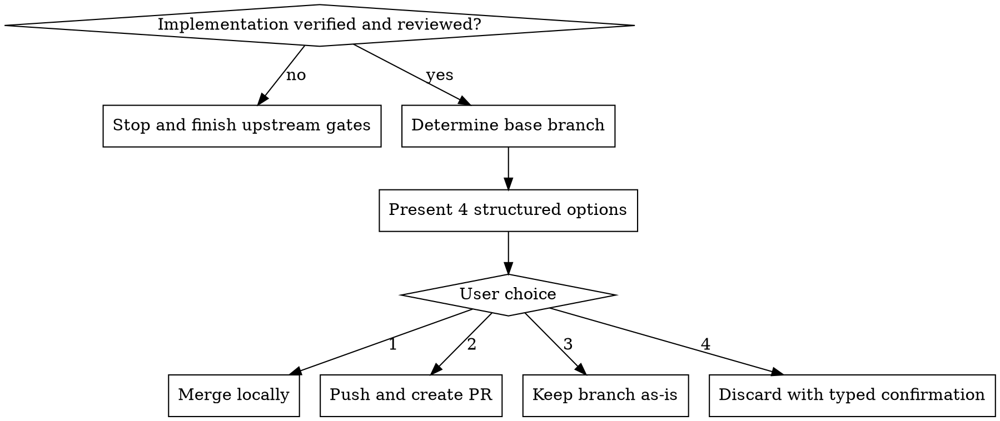

# Finishing a Development Branch

## W-Question, Evidence, and Handoff Gate

When this workflow creates, reviews, executes, verifies, delegates, completes, or hands off durable work, apply `../../../references/w-question-evidence-standard.md` proportionally before the next irreversible or hard-to-review step. Capture the relevant wer, was, wann, wo, wie, womit, wovon, wogegen, warum/wieso/weshalb, and welche evidence in the saved artifact, review, checkpoint, or final report.

Use an Evidence Ledger, Session Evidence, Decision Ledger, Autonomy Contract, Stop Conditions, and Validation Evidence when prior sessions, handovers, reviews, branches, worktrees, tools, or autonomous continuation affect safety. Stop or hand back when a required source artifact is missing, review state is stale, validation cannot prove the claim, scope or authority would expand, or the next workflow step would rely on hidden chat context.


## Overview

Separate "the code is done" from "the branch lifecycle is resolved".

This is a completion workflow. Invoke it after implementation, verification, and review are done, when the user still needs a structured choice about merge, PR, preservation, or discard.

## Hard Gate

Do not merge, discard, or clean up a branch or worktree based on vague wording alone.

If the branch outcome is not explicit, present structured options first.

Do not offer integration options until the work has already passed its required verification and review checkpoints.

## When to Use

Use this workflow when:

- implementation is complete
- verification is complete enough to support integration
- independent review is complete enough for the intended next step
- the remaining decision is merge, PR, keep-as-is, or discard

Do not use this workflow as a replacement for verification, review, or implementation.

## Process Flow



## Structured Options

Present exactly these options when the branch outcome is not already explicit:

```text
Implementation complete. What would you like to do?

1. Merge back to <base-branch> locally
2. Push and create a Pull Request
3. Keep the branch as-is
4. Discard this work
```

Do not replace this with vague prompts like "What next?" when the real decision is branch disposition.

## Workflow-Specific Harness

### Verify the workflow is actually ready

Before offering options, confirm that the upstream gates are already satisfied:

- implementation work is complete enough for integration
- verification evidence exists for the claims being made
- independent review has happened when the workflow required it

If any of these are still open, route back to the relevant workflow instead of pretending branch-finishing is available.

### Determine the base branch carefully

Use repo evidence first.

- check the current branch and merge-base against common base branches
- if the intended base branch is still ambiguous, ask a short clarification question before presenting options

### Execute the chosen option safely

#### Option 1: Merge locally

- switch to the base branch
- update it if that is part of the repo's normal flow
- merge the feature branch
- run the relevant post-merge verification
- delete the feature branch only after the merge result is verified
- if a dedicated worktree was used, it can be removed after the merge is safely complete

#### Option 2: Push and create a PR

- push the branch
- create the PR with a concise summary and test plan
- do not automatically delete the branch or worktree just because the PR exists

#### Option 3: Keep the branch as-is

- report the branch and worktree locations clearly
- do not clean them up

#### Option 4: Discard this work

This is destructive. Require explicit typed confirmation.

Show what will be deleted:

- the branch name
- the relevant commits if practical
- the worktree path if one exists

Require an exact confirmation token such as `discard` before deleting the branch or removing the worktree.

## Rationalizations

| Excuse | Reality |
|--------|---------|
| "The user said to clean it up, so I can infer the rest." | Cleanup is ambiguous. Present the structured branch options first. |
| "A PR is created, so I can delete the local workspace." | A PR does not imply the user wants local cleanup. |
| "Discard is obvious here." | Destructive actions still require explicit confirmation. |
| "Everything passed, so I can just merge now." | Integration choice belongs to the user unless already made explicit. |

## Red Flags

- vague cleanup wording treated as permission to delete branch or worktree
- offering merge or PR paths before verification and review are done
- deleting a branch without explicit user intent
- deleting worktree state automatically after PR creation
- asking open-ended questions where the 4 structured options would be clearer

All of these mean: stop and restore the structured completion flow.

## Parallel Use

Use this after the relevant upstream gates have already run, typically alongside the results of:

- `verification-before-completion`
- `requesting-code-review`

This workflow is about branch disposition and integration choice, not about proving correctness itself.

## Final Rule

```text
Done code is not the same thing as a resolved branch lifecycle.
```
