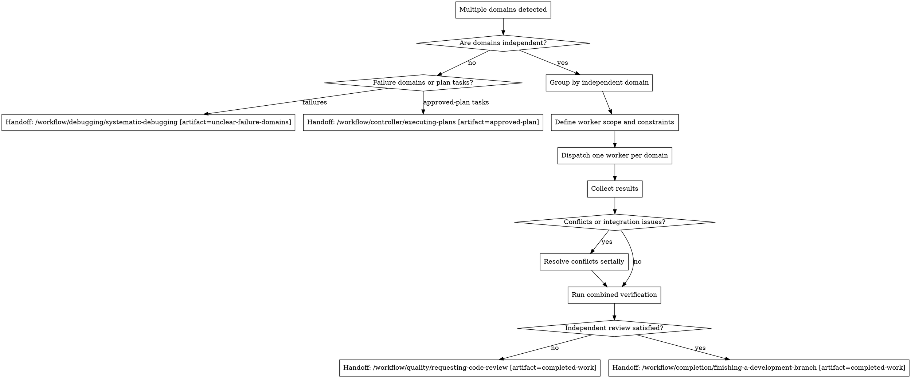

# Dispatching Parallel Agents

## W-Question, Evidence, and Handoff Gate

When this workflow creates, reviews, executes, verifies, delegates, completes, or hands off durable work, apply `../../../references/w-question-evidence-standard.md` proportionally before the next irreversible or hard-to-review step. Capture the relevant wer, was, wann, wo, wie, womit, wovon, wogegen, warum/wieso/weshalb, and welche evidence in the saved artifact, review, checkpoint, or final report.

Use an Evidence Ledger, Session Evidence, Decision Ledger, Autonomy Contract, Stop Conditions, and Validation Evidence when prior sessions, handovers, reviews, branches, worktrees, tools, or autonomous continuation affect safety. Stop or hand back when a required source artifact is missing, review state is stale, validation cannot prove the claim, scope or authority would expand, or the next workflow step would rely on hidden chat context.


## Overview

Split independent domains into separate parallel workstreams instead of forcing one controller to carry them serially.

This is a controller for parallelization across independent domains. Use it when multiple failures or task groups are unrelated enough to justify separate workers or agent tracks.

It does not replace `test-driven-development`. Each parallel worker must use TDD for behavior-changing slices when a meaningful failing test can be written.

## Hard Gate

Do not parallelize tasks that share unstable files, hidden state, or causal uncertainty.

Do not dispatch parallel workers until you have explicitly grouped the work into independent domains.

Do not assume independence just because issues surfaced at the same time.

## When to Use

Use this workflow when:

- 2 or more failures appear in clearly separate subsystems
- multiple task groups from an `approved-plan` are independent and can proceed without sequencing
- each workstream can be understood and verified without depending on the others
- parallelism is available and likely to reduce wall-clock time without raising merge risk
- behavior-changing worker slices can still follow TDD independently inside their domain

Do not use this workflow when:

- failures may share one root cause
- tasks edit the same unstable surface
- a single debugging pass is still needed to understand the system
- reintegration risk outweighs the benefit of parallelism

## Process Flow



## Workflow-Specific Harness

### Step 1: Prove independence first

Before dispatching parallel workers, group the work into domains and state why they are independent.

Check:

- different files or stable interfaces
- no shared causal uncertainty
- no required sequential ordering
- separate verification paths

If you cannot defend the grouping clearly, do not parallelize yet.

Fallback depends on the artifact:

- unclear failure domains -> `Handoff: /workflow/debugging/systematic-debugging [artifact=unclear-failure-domains]`
- non-independent task groups from an `approved-plan` -> `Handoff: /workflow/controller/executing-plans [artifact=approved-plan]`

### Step 2: Create focused worker scopes

Each worker should receive:

- one domain only
- exact scope and boundaries
- constraints on files or subsystems
- expected output and verification expectations
- TDD requirement for behavior-changing code slices: failing test first, verify RED, implement minimal GREEN, refactor while green
- a reminder not to solve neighboring domains

Do not hand workers the whole problem blob and hope they self-partition correctly.

### Step 3: Dispatch and isolate

Use one worker per domain only when the domains do not interfere.

Examples of safe splits:

- flaky CI test file versus unrelated UI regression
- signing pipeline failure versus isolated frontend layout bug
- one plan slice for API docs versus another for UI copy, if they do not overlap

Examples of unsafe splits:

- two failures in the same auth pipeline before the root cause is known
- multiple workers editing the same unstable module
- one task's output changes another task's requirements

### Step 4: Reintegrate deliberately

After workers return:

- read each result summary
- verify the changes actually stayed within scope
- detect overlapping edits or hidden coupling
- resolve conflicts serially when needed
- run combined verification after reintegration
- persist verification evidence and review status in the plan, parallel-state artifact, or final summary
- request independent review before completion when required by the plan, risk level, or `requesting-code-review`

Do not trust parallel success reports until the combined state is verified and required review is satisfied.

## Rationalizations

| Excuse | Reality |
|--------|---------|
| "Everything is broken, so parallelism must help." | Parallelism helps only after domain independence is proven. |
| "These tasks look separate enough." | "Looks separate" is weaker than explicit scope and file-boundary analysis. |
| "The workers can figure out the boundaries." | Boundary definition is a controller job, not a worker guess. |
| "I will merge the results and sort it out later." | Late reintegration is how parallel drift turns into cleanup debt. |

## Red Flags

- dispatching workers before grouping domains
- one worker prompt covering multiple unrelated failures
- overlapping unstable file scopes between workers
- skipping combined verification after reintegration
- treating simultaneous appearance as proof of independence

All of these mean: stop and restore explicit domain grouping first.

## Parallel Companion Gates

Use these alongside this controller when they are installed:

- `/workflow/quality/verification-before-completion` before broad completion claims
- `/workflow/quality/requesting-code-review` after reintegration or for risky domains

This controller governs parallel domain splitting. Quality gates still apply after reintegration.

## Final Rule

```text
Parallelism is a reward for proven independence, not a substitute for understanding the work.
```
