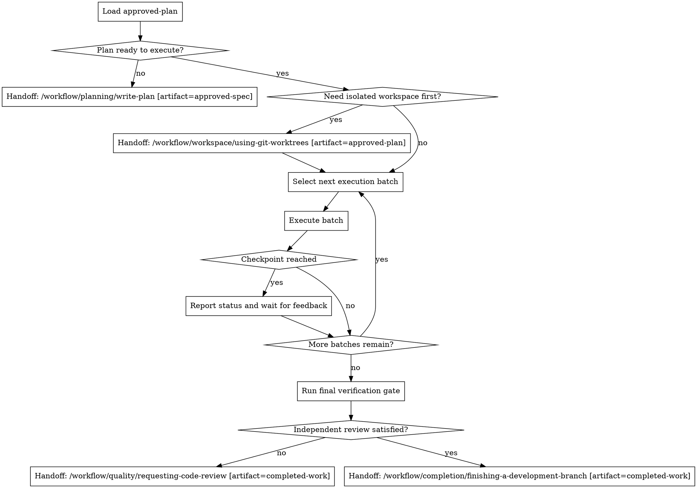

# Executing Plans

## W-Question, Evidence, and Handoff Gate

When this workflow creates, reviews, executes, verifies, delegates, completes, or hands off durable work, apply `../../../references/w-question-evidence-standard.md` proportionally before the next irreversible or hard-to-review step. Capture the relevant wer, was, wann, wo, wie, womit, wovon, wogegen, warum/wieso/weshalb, and welche evidence in the saved artifact, review, checkpoint, or final report.

Use an Evidence Ledger, Session Evidence, Decision Ledger, Autonomy Contract, Stop Conditions, and Validation Evidence when prior sessions, handovers, reviews, branches, worktrees, tools, or autonomous continuation affect safety. Stop or hand back when a required source artifact is missing, review state is stale, validation cannot prove the claim, scope or authority would expand, or the next workflow step would rely on hidden chat context.


## Overview

Turn an `approved-plan` artifact into controlled execution instead of ad-hoc task drift.

This is a controller workflow. It does not replace implementation discipline such as `test-driven-development`; it governs how a multi-task plan is executed, checkpointed, and handed through the already installed execution, review, verification, and completion workflows.

## Hard Gate

Do not start executing the plan until you have re-read it critically and confirmed there is no blocker or critical ambiguity.

Do not keep the whole plan as vague intent in memory. Externalize progress and batch boundaries explicitly.

Do not bulldoze through blockers, repeated verification failures, or unresolved plan gaps. Stop and escalate instead of guessing.

If the user explicitly authorizes autonomous execution (for example "autonom den Plan abarbeiten", "work autonomously", "YOLO mode", or equivalent), do not turn routine batch checkpoints into user approval pauses. Record status durably and continue until a real stop condition occurs.

## When to Use

Use this workflow when:

- an `approved-plan` artifact exists and should be executed in the current session
- the plan spans multiple task groups or files
- controlled batching and checkpoints are needed
- progress tracking must stay explicit rather than implicit

Do not use this workflow when:

- the next task is a single small implementation slice that can go directly to `test-driven-development`
- task groups are mostly independent and same-session delegated execution is the better fit for `/workflow/controller/subagent-driven-development`
- task groups are independent enough that `/workflow/controller/dispatching-parallel-agents` is the better fit
- the plan itself still has critical ambiguities and should return to framing or planning first

## Process Flow



## Workflow-Specific Harness

### Step 1: Re-read the plan critically

Before starting execution:

- read the full `approved-plan` artifact
- confirm task order, dependencies, and verification steps still make sense
- identify blockers, missing files, or instructions you do not understand
- if critical gaps exist, stop and return to planning instead of inventing fixes

### Step 2: Externalize progress

Track execution state explicitly in a concrete Pi-visible surface.

Preferred order:

1. update the saved plan's checkbox/task state when that is the project convention
2. write or update an adjacent execution-state artifact such as `execution-state.md`
3. use the current runtime's task tracker only when it is visible and durable enough for the session

- represent each task group or atomic task explicitly
- mark only one item `in_progress` at a time unless the plan explicitly supports parallel work
- keep completed work synchronized with the plan or execution-state artifact instead of summarizing from memory later
- do not rely on hidden chat context as the only progress source

### Step 3: Prepare the execution surface

If the repo state or branch hygiene suggests isolation:

`Handoff: /workflow/workspace/using-git-worktrees [artifact=approved-plan]`

Otherwise proceed in the current workspace only when it is clearly safe.

### Step 4: Execute in batches

Default batching rule:

- use the first 2-3 closely related tasks as one batch
- keep dependent steps in the same batch only when they must be executed together
- split earlier if the plan contains natural checkpoint boundaries

During each task in the batch:

- follow the plan exactly
- use `/workflow/debugging/systematic-debugging` when a failure path has unclear cause
- use `/workflow/execution/test-driven-development` for known implementation or fix steps
- run the plan's specified verification as you go

### Step 5: Checkpoint after each batch

After each completed batch:

- summarize what changed
- summarize the actual verification evidence
- note blockers, deviations, or follow-up concerns
- if autonomous execution is active, persist the checkpoint and continue without waiting
- otherwise wait for user feedback when the batch boundary is review-worthy or the plan explicitly expects checkpointing

### Step 6: Finish through the completion workflow

When all batches are complete and their checkpoints are satisfied:

1. run the final verification gate required by the plan and `verification-before-completion`
2. confirm independent review is complete when required by the plan, risk level, or `requesting-code-review`
3. persist verification and review evidence in the plan, execution-state artifact, or final summary
4. only then emit `Handoff: /workflow/completion/finishing-a-development-branch [artifact=completed-work]`

If review is still missing, emit `Handoff: /workflow/quality/requesting-code-review [artifact=completed-work]` instead.

## Stop Conditions

Stop execution and ask instead of guessing when:

- a task is unclear and cannot be resolved from the approved plan, spec, repo evidence, or existing conventions
- a dependency is missing and there is no safe local installation or documented fallback
- verification fails repeatedly after root-cause debugging
- the plan conflicts with actual repo state in a way that changes product intent, migration scope, or public API behavior
- the safest next action is no longer obvious after evidence gathering

## Rationalizations

| Excuse | Reality |
|--------|---------|
| "The plan is approved, I can just execute from memory." | Plans drift in memory. Re-read and track execution explicitly. |
| "I can do all tasks first and summarize later." | Long-plan drift hides mistakes and weakens review checkpoints. |
| "A dedicated batch boundary is unnecessary here." | Without checkpoints, execution quality becomes inconsistent and hard to review. |
| "I hit a blocker, but I can probably infer the intended step." | Controllers stop on blockers; they do not guess through them. |

## Red Flags

- executing the whole plan as one undifferentiated blob
- losing sync between actual progress and tracked task state
- skipping verification inside batches because a later batch will cover it
- silently changing plan order without recording why
- continuing through blockers instead of pausing

All of these mean: stop and restore controller discipline.

## Parallel Companion Gates

Use these alongside this controller when they are installed:

- `/workflow/quality/verification-before-completion` before any broad success claim
- `/workflow/quality/requesting-code-review` after meaningful batches or before integration

This controller decides execution order and checkpoints. The quality gates still apply in parallel.

## Final Rule

```text
An approved plan still needs a controller, not just good intentions.
```
