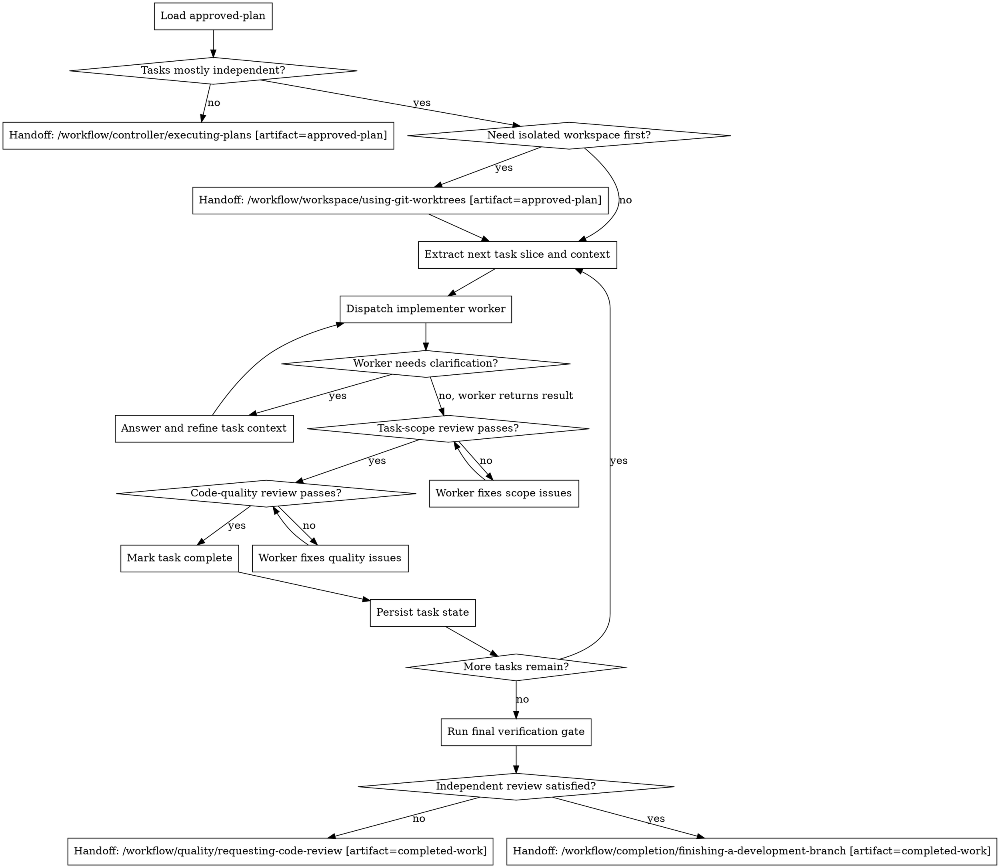

# Subagent-Driven Development

## W-Question, Evidence, and Handoff Gate

When this workflow creates, reviews, executes, verifies, delegates, completes, or hands off durable work, apply `../../../references/w-question-evidence-standard.md` proportionally before the next irreversible or hard-to-review step. Capture the relevant wer, was, wann, wo, wie, womit, wovon, wogegen, warum/wieso/weshalb, and welche evidence in the saved artifact, review, checkpoint, or final report.

Use an Evidence Ledger, Session Evidence, Decision Ledger, Autonomy Contract, Stop Conditions, and Validation Evidence when prior sessions, handovers, reviews, branches, worktrees, tools, or autonomous continuation affect safety. Stop or hand back when a required source artifact is missing, review state is stale, validation cannot prove the claim, scope or authority would expand, or the next workflow step would rely on hidden chat context.


## Overview

Use fresh delegated workers per task instead of carrying the whole implementation directly in one controller context.

This is a controller workflow for same-session delegated execution. It is the alternative to `executing-plans` when task groups are independent enough to hand off as discrete slices and when you want explicit per-task reintegration and review.

It does not replace `test-driven-development`. Each delegated worker must use TDD for behavior-changing slices when a meaningful failing test can be written.

## Hard Gate

Do not use this workflow when tasks are tightly coupled, depend on the same unfinished files in unstable ways, or require continuous shared reasoning.

Do not delegate without giving the worker the exact task slice, governing context, and acceptance criteria.

Do not mark a delegated task complete until it has passed both task-scope review and code-quality review.

If the user explicitly authorizes autonomous execution (for example "autonom den Plan abarbeiten", "work autonomously", "YOLO mode", or equivalent), do not pause for routine delegation, task-scope review, code-quality review, or reintegration checkpoints. Persist each checkpoint and continue. Ask only when a worker surfaces a genuine blocker that cannot be resolved from the approved plan, spec, repo evidence, or existing conventions.

## When to Use

Use this workflow when:

- an `approved-plan` artifact exists
- task groups are mostly independent
- delegated execution is available in the current runtime
- same-session orchestration is preferred over manual batch execution
- per-task reintegration and review are more valuable than one long controller run
- TDD is still required inside each behavior-changing worker slice unless the approved plan explicitly classifies that slice as non-testable configuration, documentation, or generated output

Do not use this workflow when:

- tasks are tightly coupled and should stay under one controller pass
- delegated workers are unavailable
- the next step is only one small implementation slice that can go directly to `test-driven-development`

## Process Flow



## Workflow-Specific Harness

### Step 1: Read and slice the plan

Before delegating:

- read the full `approved-plan` artifact
- extract each task group with its exact text and local context
- note dependencies, acceptance criteria, file scope, and verification expectations
- persist authoritative task slices in the saved plan, an adjacent delegation-state artifact, or another Pi-visible file before dispatch
- do not keep authoritative slices only in controller chat context and do not tell workers to infer scope from the whole plan blindly

### Step 2: Decide whether delegation is actually safe

Use this controller only when the task slice is independent enough.

Signals delegation is safe:

- distinct file groups
- stable interfaces between slices
- limited cross-task shared state
- reviewable reintegration points

Signals delegation is unsafe:

- multiple tasks editing the same unstable surface
- order-dependent design decisions still being made during execution
- one task's output changes another task's requirements continuously

If delegation is unsafe, use:

`Handoff: /workflow/controller/executing-plans [artifact=approved-plan]`

### Step 3: Prepare the execution surface

If branch hygiene or repo state suggests isolation:

`Handoff: /workflow/workspace/using-git-worktrees [artifact=approved-plan]`

Then continue delegated execution in the isolated workspace.

### Step 4: Dispatch one implementer per task slice

For each task slice:

- provide the exact task text
- provide the governing `approved-plan` context relevant to that slice
- provide file scope, constraints, and verification expectations
- require TDD for behavior-changing code slices: failing test first, verify RED, implement minimal GREEN, refactor while green
- require the worker to resolve routine uncertainties from provided context, repo evidence, and existing conventions before surfacing a question
- require the worker to surface only genuine blockers instead of guessing

Do not dispatch multiple implementers against conflicting task slices on the same unstable surface.

### Step 5: Enforce the two review stages

After the worker returns implementation and evidence:

1. task-scope review
   - does the result match the assigned task slice and governing plan?
   - are required pieces missing or did the worker overbuild?

2. code-quality review
   - is the result technically sound, readable, and safe?
   - do verification and tests support the claimed outcome?

If either review fails:

- return the issue list to the same worker
- get a fix
- re-run the relevant review stage

Do not mark the task complete until both stages pass.

### Step 6: Reintegrate task by task

After each task:

- record completion explicitly in the plan, delegation-state artifact, or another Pi-visible state file
- record task-scope review result, code-quality review result, verification evidence, and deviations
- keep the controller's task state in sync
- carry forward only the updated facts the next task needs
- in autonomous execution, continue to the next task after recording this checkpoint unless a real stop condition exists

This prevents controller drift and cross-task context pollution.

### Step 7: Finish through the completion workflow

When all delegated tasks are complete and integrated:

1. run combined verification over the reintegrated state
2. confirm independent review is complete when required by the plan, risk level, or `requesting-code-review`
3. persist final verification and review evidence in the plan, delegation-state artifact, or final summary
4. only then emit `Handoff: /workflow/completion/finishing-a-development-branch [artifact=completed-work]`

If review is still missing, emit `Handoff: /workflow/quality/requesting-code-review [artifact=completed-work]` instead.

## Rationalizations

| Excuse | Reality |
|--------|---------|
| "These tasks look independent enough; I can just delegate loosely." | Loose delegation without task slices and review stages creates drift. |
| "The worker can read the whole plan itself." | The controller must curate the exact task slice and context. |
| "One review is enough." | Scope review and code-quality review catch different failures. |
| "I can mark it complete and review later." | Deferred review is how delegated mistakes compound. |
| "Parallel workers are faster, I’ll just send several on overlapping files." | Conflicting delegated work creates reintegration risk and weak accountability. |

## Red Flags

- ad hoc delegation without exact task text
- worker asked to infer scope from the whole repo or whole plan
- skipping re-review after worker fixes issues
- marking tasks complete on worker self-report alone
- sending multiple workers into overlapping unstable files

All of these mean: stop and restore delegated-controller discipline.

## Parallel Companion Gates

Use these alongside this controller when they are installed:

- `/workflow/quality/verification-before-completion` before broad success claims
- `/workflow/quality/requesting-code-review` as the source of independent code-quality review expectations

This controller governs delegation and reintegration. The quality gates still apply in parallel.

## Final Rule

```text
Delegation is only safe when task slices, review stages, and reintegration are explicit.
```
