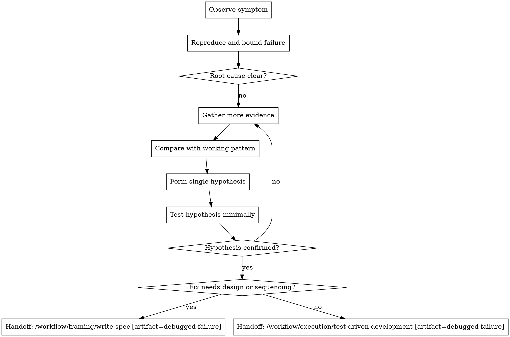

# Systematic Debugging

## W-Question, Evidence, and Handoff Gate

When this workflow creates, reviews, executes, verifies, delegates, completes, or hands off durable work, apply `../../../references/w-question-evidence-standard.md` proportionally before the next irreversible or hard-to-review step. Capture the relevant wer, was, wann, wo, wie, womit, wovon, wogegen, warum/wieso/weshalb, and welche evidence in the saved artifact, review, checkpoint, or final report.

Use an Evidence Ledger, Session Evidence, Decision Ledger, Autonomy Contract, Stop Conditions, and Validation Evidence when prior sessions, handovers, reviews, branches, worktrees, tools, or autonomous continuation affect safety. Stop or hand back when a required source artifact is missing, review state is stale, validation cannot prove the claim, scope or authority would expand, or the next workflow step would rely on hidden chat context.


## Overview

Do not patch symptoms when the cause is still unknown.

This is the active debugging workflow when a failure exists but the next safe step is not implementation yet. Use it before `test-driven-development` whenever the root cause is still unclear.

## Hard Gate

Do not propose or implement a fix until you have investigated the root cause.

If you have not reproduced the problem, bounded the failing layer, or formed a specific evidence-backed hypothesis, you are not ready to fix it.

## When to Use

Use this workflow when:

- a test is failing and the reason is still unclear
- a bug is reported but the failure path is not yet understood
- a build, CI, deploy, or integration step fails in an unclear layer
- behavior is intermittent, timing-dependent, or environment-sensitive
- you already tried one or more fixes and still do not understand the real cause

Do not use this workflow when:

- the root cause is already understood and the next safe step is to implement the fix
- the issue is already reduced to a known behavior change that should go through `test-driven-development`

## Quick Gate

- root cause unclear -> debug first
- failure not reproducible -> gather evidence until bounded
- multi-component path unclear -> instrument boundaries before fixing
- deep stack symptom -> trace backward to source
- 2 or more clearly independent failing domains -> consider `/workflow/controller/dispatching-parallel-agents`
- root cause understood and fix is small/testable -> hand off to `test-driven-development` with `debugged-failure`
- root cause understood but fix needs design, migration, API, or multi-file sequencing -> hand off to `write-spec` first with `debugged-failure`

## Process Flow



## Workflow-Specific Harness

### Phase 1: Root Cause Investigation

Before any fix attempt:

1. read the full error message, stack trace, and failing output
2. reproduce the issue as consistently as possible
3. inspect recent changes, environment differences, and nearby boundaries
4. if the system has multiple components, instrument each boundary until the failing layer is known
5. if the symptom appears deep in a call chain, trace backward to the original trigger

For backward tracing patterns, read `references/root-cause-tracing.md`.

### Phase 2: Pattern Analysis

After the failing layer is bounded:

- find similar working code or workflow paths
- compare the working path against the failing one
- list the concrete differences instead of assuming which one matters
- understand dependencies and assumptions before choosing a fix direction

### Phase 3: Hypothesis and Minimal Testing

- form one specific hypothesis
- test it with the smallest possible diagnostic or change
- do not stack multiple fixes together
- if the hypothesis fails, return to evidence gathering instead of patching anyway

### Phase 4: Hand Off to Fixing

Once the root cause is understood, choose the smallest safe next artifact:

- small, directly testable root-cause fix -> `Handoff: /workflow/execution/test-driven-development [artifact=debugged-failure]`
- broader design or sequencing needed -> `Handoff: /workflow/framing/write-spec [artifact=debugged-failure]`; planning comes later only after an approved spec exists

The `debugged-failure` artifact must include reproduction steps, observed failure, bounded failing layer, confirmed root cause, expected corrected behavior, and the regression test idea. At that point the next safe step is a failing regression test and a root-cause fix, not more ad-hoc debugging.

## Multi-Component Evidence Pattern

When the system crosses boundaries such as `CI -> build -> signing` or `API -> service -> database`:

- log what enters each boundary
- log what exits each boundary
- verify environment or config propagation at each layer
- run once to discover exactly where the chain breaks

Do not start with a fix while the failing layer is still unknown.

## Rationalizations

| Excuse | Reality |
|--------|---------|
| "We need a quick fix now, we can investigate later." | Patch-first debugging usually preserves the bug and adds rework. |
| "The logs point strongly enough in one direction." | Strong hints are not root-cause proof. Bound the failing layer first. |
| "I'll just add retries or waits to stabilize it." | Timing patches can hide concurrency or state bugs instead of fixing them. |
| "I already tried two fixes, one more will probably do it." | Repeated ungrounded fixes are a sign to return to evidence, not keep guessing. |
| "I can plan the fix before I fully isolate it." | Planning a guessed fix is still guessing. Investigate first. |

## Red Flags

- proposing a fix before reproducing the issue
- changing timeouts, retries, guards, or waits before bounding the cause
- stacking multiple changes to see what sticks
- using manual intuition instead of evidence in multi-component failures
- treating the symptom location as the source automatically

All of these mean: stop and return to investigation.

## Parallel Companion Gates

Use these alongside debugging when they are installed:

- `/workflow/controller/dispatching-parallel-agents` when multiple failure domains are proven independent
- `verification-before-completion` via `/workflow/quality/verification-before-completion` before claiming the bug is fixed

After the root cause is understood and the fix is implemented, the usual execution and review gates apply again.

## Final Rule

```text
No fix without root-cause investigation first.
```
