# Test-Driven Development

## W-Question, Evidence, and Handoff Gate

When this workflow creates, reviews, executes, verifies, delegates, completes, or hands off durable work, apply `../../../references/w-question-evidence-standard.md` proportionally before the next irreversible or hard-to-review step. Capture the relevant wer, was, wann, wo, wie, womit, wovon, wogegen, warum/wieso/weshalb, and welche evidence in the saved artifact, review, checkpoint, or final report.

Use an Evidence Ledger, Session Evidence, Decision Ledger, Autonomy Contract, Stop Conditions, and Validation Evidence when prior sessions, handovers, reviews, branches, worktrees, tools, or autonomous continuation affect safety. Stop or hand back when a required source artifact is missing, review state is stale, validation cannot prove the claim, scope or authority would expand, or the next workflow step would rely on hidden chat context.


## Overview

Write the test first. Watch it fail. Write the smallest production change that makes it pass.

This is the canonical execution discipline after planning when the next step is implementation rather than further investigation. Treat the plan as the source of intended behavior, then prove each behavior with a failing test before writing production code.

## Hard Gate

Do not write production code until a failing test exists for the next behavior change.

If code was already written first, delete it and restart from the test.

Do not keep implementation-first code as reference, do not adapt it while writing tests, and do not rationalize that an approved spec or plan makes test-first optional.

## When to Use

Use this workflow when:

- an `approved-plan` artifact exists and the next step is implementation
- a `debugged-failure` artifact exists from `systematic-debugging` and the next safe step is a regression test plus root-cause fix
- a new feature or behavior change is being built
- a bugfix is being implemented and the failing behavior can already be reproduced
- refactoring changes behavior or needs regression protection

Do not use this workflow when:

- root cause is still unclear and investigation must continue first
- the task is throwaway prototyping or generated code and the user explicitly accepts that trade-off
- the change is configuration-only and no meaningful failing test can exist

## Quick Gate

- next behavior unclear -> stop and re-read the plan or spec
- root cause unclear -> investigate before coding
- next behavior clear -> write one failing test
- failing test wrong or passes immediately -> fix the test, not the code
- test fails for expected reason -> write minimal code
- test passes -> refactor only while staying green

## Process Flow

```dot
digraph tdd_cycle {
    rankdir=LR;
    "Read execution contract" [shape=box];
    "Approved-plan or debugged-failure?" [shape=diamond];
    "Handoff: /workflow/planning/write-plan [artifact=approved-spec]" [shape=box];
    "Write failing test" [shape=box];
    "Test fails for expected reason?" [shape=diamond];
    "Fix test" [shape=box];
    "Write minimal production code" [shape=box];
    "Test passes cleanly?" [shape=diamond];
    "Fix production code" [shape=box];
    "Refactor while green" [shape=box];
    "Next behavior" [shape=ellipse];

    "Read execution contract" -> "Approved-plan or debugged-failure?";
    "Approved-plan or debugged-failure?" -> "Write failing test" [label="yes"];
    "Approved-plan or debugged-failure?" -> "Handoff: /workflow/planning/write-plan [artifact=approved-spec]" [label="no, planning needed"];
    "Write failing test" -> "Test fails for expected reason?";
    "Test fails for expected reason?" -> "Fix test" [label="no"];
    "Fix test" -> "Write failing test";
    "Test fails for expected reason?" -> "Write minimal production code" [label="yes"];
    "Write minimal production code" -> "Test passes cleanly?";
    "Test passes cleanly?" -> "Fix production code" [label="no"];
    "Fix production code" -> "Test passes cleanly?";
    "Test passes cleanly?" -> "Refactor while green" [label="yes"];
    "Refactor while green" -> "Next behavior";
    "Next behavior" -> "Write failing test";
}
```



## Workflow-Specific Harness

### Start from one execution contract slice

Do not implement the whole plan or bugfix at once.

Use one of these contracts:

- `approved-plan`: pick one small behavior from the plan artifact
- `debugged-failure`: pick the confirmed failing behavior and root-cause hypothesis from the debugging artifact

For either contract:

- restate the expected outcome in testable terms
- prefer one behavior per test
- if a `debugged-failure` requires broad design, migration, API, or multi-file sequencing beyond a small root-cause fix, stop and hand off to `write-spec` or `write-plan` before coding

### RED - write the failing test first

Write the smallest test that proves the next behavior should exist.

Confirm all of the following:

- the test fails, not errors unexpectedly
- it fails for the reason you expect
- it demonstrates real behavior rather than mock behavior

If the test passes immediately, you are not testing the new behavior yet.

### GREEN - write the minimum code

After the test fails correctly:

- write the smallest production change that can pass it
- do not add extra behavior
- do not refactor unrelated code
- do not bundle multiple fixes into one step

### REFACTOR - clean up only while green

After the test passes:

- remove duplication
- improve names
- extract helpers only when they clarify the code

Keep the test suite green while refactoring.

## Common Rationalizations

| Excuse | Reality |
|--------|---------|
| "This is simple, I can code first." | Small changes still regress behavior. Write the failing test first. |
| "The spec and plan are already approved." | Approved artifacts describe intent, not proof. TDD still starts with a failing test. |
| "Systematic debugging already reproduced the bug." | Reproduction is the input. TDD still turns it into a failing regression test before production code. |
| "I'll add tests after the fix works." | Tests that pass immediately prove nothing about the missing behavior. |
| "I already manually verified it." | Manual checks are ad-hoc and non-repeatable. Automated failing tests prove the bug or feature gap. |
| "I already wrote the code, deleting it is wasteful." | Keeping implementation-first code bakes in bias. Delete means delete. |

## Red Flags

- production code before test
- test added after implementation
- test passes immediately
- using spec approval as reason to skip test-first
- using manual checks as substitute for a failing test
- saying "just this once"

All of these mean: stop and restart from RED.

## Verification Checklist

Before claiming implementation is complete:

- [ ] each new behavior started with a failing test
- [ ] each failing test failed for the expected reason
- [ ] production code was added only after RED was verified
- [ ] all relevant tests pass now
- [ ] output is clean enough to trust the result
- [ ] edge cases and error paths were covered where they materially affect behavior

## Parallel Companion Gates

These do not replace TDD and do not belong in this workflow's DOT because they are parallel discipline or lifecycle gates rather than the next active coding step.

Use them alongside this workflow when they are installed:

- `using-git-worktrees` via `/workflow/workspace/using-git-worktrees` before implementation when execution should not happen in the current dirty or shared workspace
- `verification-before-completion` via `/workflow/quality/verification-before-completion` before claiming the implementation or tests are complete
- `requesting-code-review` via `/workflow/quality/requesting-code-review` after meaningful implementation slices or before merge
- `finishing-a-development-branch` via `/workflow/completion/finishing-a-development-branch` after the implementation work is finished and verified

If root cause is still unclear before RED, switch to `/workflow/debugging/systematic-debugging` rather than pretending TDD can replace investigation.

## Testing Anti-Patterns

When adding mocks, fake responses, or test utilities, read `references/testing-anti-patterns.md`.

## Final Rule

```text
Production code without a failing test first is not TDD.
```
