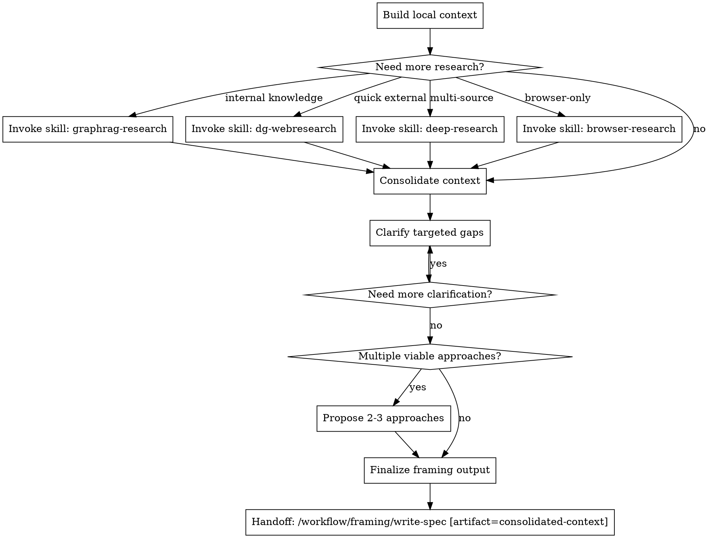

# Brainstorming

## W-Question, Evidence, and Handoff Gate

When this workflow creates, reviews, executes, verifies, delegates, completes, or hands off durable work, apply `../../../references/w-question-evidence-standard.md` proportionally before the next irreversible or hard-to-review step. Capture the relevant wer, was, wann, wo, wie, womit, wovon, wogegen, warum/wieso/weshalb, and welche evidence in the saved artifact, review, checkpoint, or final report.

Use an Evidence Ledger, Session Evidence, Decision Ledger, Autonomy Contract, Stop Conditions, and Validation Evidence when prior sessions, handovers, reviews, branches, worktrees, tools, or autonomous continuation affect safety. Stop or hand back when a required source artifact is missing, review state is stale, validation cannot prove the claim, scope or authority would expand, or the next workflow step would rely on hidden chat context.

## Overview

Use this framing workflow to build the strongest available context before writing a spec.

This is a research-first workflow. Start with local and external research, consolidate the findings, close the remaining targeted gaps, then hand off the `consolidated-context` artifact to `write-spec`.

## Hard Gate

Do not implement code or trigger execution workflows from this workflow.

Do not hand off to planning until a spec exists. The intended flow is:

`brainstorming -> write-spec -> write-plan`

## When to Use

Use this workflow when:

- scope is still unclear
- constraints are incomplete
- the affected areas are not yet mapped well enough for spec writing from memory alone
- multiple approaches might exist but the trade-offs are not yet grounded in evidence
- rollout shape, integration boundaries, or migration phases still need research-backed framing

Do not use this workflow for:

- direct execution
- implementation planning after a spec already exists
- post-implementation verification
- code review

## Quick Gate

- build local context first
- expand with internal and external research as needed
- clarify only the gaps that research could not settle
- propose approaches only when there are real alternatives
- consolidate the framing output
- hand off to `write-spec`

## Process Flow

## Workflow-Specific Harness

### Build local context first

Start with local project evidence before escalating outward:

1. Read the nearest relevant instruction files, starting with `AGENTS.md`.
2. Read repo docs that constrain architecture, rollout, operations, or testing.
3. Inspect the relevant source files, tests, and existing patterns.
4. Inspect recent history when it sharpens affected areas or prior decisions.

### Escalate research deliberately

Use additional research only when it materially improves the framing quality:

- use `graphrag-research` when prior internal findings, decisions, or procedures matter
- use `dg-webresearch` for quick external discovery
- use `deep-research` when multiple external sources must be compared
- use `browser-research` when the source is browser-only or JavaScript-rendered

Research is the default expansion path for this workflow.

### Clarify only targeted gaps

After research, ask only the questions that the available evidence still cannot answer.

- ask one question at a time
- prefer constrained choices when possible
- focus on goals, constraints, rollout shape, non-goals, and acceptance signals
- do not ask broad exploratory questions that research could have answered

### Propose approaches only when alternatives are real

If research and clarification still leave multiple viable directions:

- propose 2-3 approaches
- explain the trade-offs clearly
- recommend one option when the evidence supports it
- do not invent alternatives when one path is already clearly best

### Finalize for spec handoff

Before handoff, consolidate the framing result so `write-spec` can draft from it directly.

The `consolidated-context` artifact should make these points explicit when relevant:

- scope boundaries
- affected systems or files
- constraints and assumptions
- trade-offs and recommended direction
- rollout shape or migration phases
- open questions that still must be recorded in the spec

Then emit:

`Handoff: /workflow/framing/write-spec [artifact=consolidated-context]`

## Common Mistakes

- skipping local inspection and jumping straight to external research
- asking broad questions before doing obvious research
- routing directly to planning without a spec
- treating research as optional when the task is still under-framed
- inventing multiple approaches where the evidence already favors one clear path

## Handoff Rule

This DOT is the normative handoff source for this workflow.

Every automated workflow handoff must name a concrete installed workflow path and a concrete artifact name, for example:

- `Handoff: /workflow/framing/write-spec [artifact=consolidated-context]`
- `Handoff: /workflow/planning/write-plan [artifact=approved-spec]`

Research or GraphRAG skills that are not installed under `/workflow` must be invoked by explicit skill name, for example `Invoke skill: dg-webresearch [artifact=discovery-gap]`, rather than by a fake workflow path.
Do not replace handoffs with vague prose.
