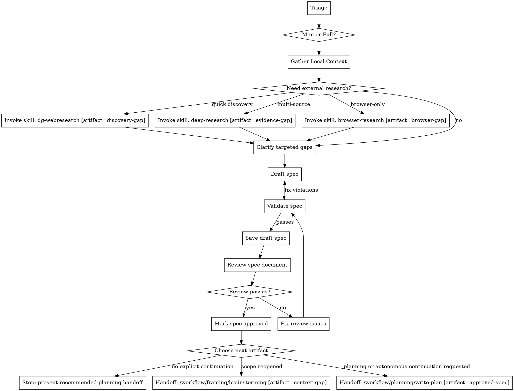

# Write Spec

## Overview

Use this framing workflow to produce a formal specification before implementation.
Treat the spec as the source of truth for later planning and execution, not as disposable pre-work.

This skill runs in Pi, but the underlying spec method is harness-agnostic and should stay reusable across other agent CLIs and orchestrators unless a runtime-specific constraint truly requires otherwise.

This workflow is the natural handoff target for:

`Handoff: /workflow/framing/write-spec [artifact=consolidated-context]`

Its usual downstream recommendation is:

`Handoff: /workflow/planning/write-plan [artifact=approved-spec]`

Artifact-boundary rule: after producing and reviewing an approved spec, stop by default and present the planning handoff as the recommended next step. Continue into `write-plan` in the same turn only when the user explicitly requested planning, implementation, or autonomous continuation in that turn.

Manual invocation in Pi:

```text
/skill:write-spec
/skill:write-spec mini
```

Write prose in the user's language unless the project already uses a fixed documentation language.

Read `references/spec-templates.md` when drafting the actual spec.
Read `references/spec-quality-checks.md` before validating and saving it.
Read `references/spec-review-prompt.md` before presenting a saved spec as approved or ready for planning.
Read `../../../references/w-question-evidence-standard.md` before drafting when the task is non-trivial, session-derived, autonomous, review-heavy, or explicitly asks for full W-question coverage.

## Hard Gate

Do not implement code in this workflow.

Do not proceed to drafting until:

- scope is understood
- affected files are identified
- the requested change addresses the root cause rather than a workaround
- relevant W-questions are answered or explicitly marked `N/A — reason`
- session, handover, GraphRAG, local-file, and external evidence dependencies are identified when they affect scope or state
- open questions are either answered or recorded explicitly

Skip this workflow for typo-only, formatting-only, or obvious single-line fixes with no design impact.
If context is still insufficient to write a safe spec, use `brainstorming` first.

## When to Use

Use this workflow when:

- the user asks to implement, build, add, create, redesign, or refactor something
- the task needs a written spec before code changes
- multiple files, subsystems, interfaces, or operational concerns may be affected
- migrations, rollout, API, schema, UX, or architectural decisions are involved
- a risky fix needs a documented plan before editing code

Do not use this workflow for:

- trivial typo fixes
- formatting-only changes
- obvious one-line fixes
- pure Q&A with no implementation artifact
- execution tasks that already have an `approved-spec` artifact and only need planning

## Quick Gate

- trivial, obvious, one-line -> skip spec
- clear change, usually 1-3 files, no meaningful alternatives -> mini spec
- 4+ files, cross-cutting, risky, research-heavy, architectural, migration, or unclear scope -> full spec
- ambiguous task classification -> `brainstorming`
- explicit `User: mini` or equivalent -> prefer mini spec unless unsafe

## Process Flow



## Workflow-Specific Harness

### Build context first

Use parallel tool calls when operations are independent.

1. Read the nearest relevant instruction files, starting with `AGENTS.md`.
2. Read repo-level docs that govern workflows, conventions, architecture, or deployment.
3. Map the affected code paths with available read-only search/listing tools. In Pi's default toolset, use `bash` for commands such as `find`, `grep` or `rg` when available, and `git status --short`; inspect relevant files with `read`.
4. Inspect recent history with `git log --oneline -20` when the target is inside a git repository.
5. Search for existing specs, ADRs, docs, tests, and similar implementation patterns.
6. Query GraphRAG when prior findings, procedures, or architecture decisions may matter.
7. Inspect recent session transcripts, handover files, execution-state artifacts, or review artifacts when the user asks to continue prior work, references last-week work, says `fahre fort`, or when the next safe state cannot be proven from current files alone.
8. If ports may change, inspect `~/PORTS.md` before drafting and include its update in the affected files and implementation steps.

### Escalate research only when local context is insufficient

- use `dg-webresearch` for quick source discovery
- use `deep-research` when multiple sources must be compared or validated
- use `browser-research` when the relevant source depends on JavaScript, DOM interaction, or browser-only state

Only keep findings that materially influence the design.

### Apply the W-question and evidence standard

Before drafting any non-trivial spec, apply `../../../references/w-question-evidence-standard.md` proportionally.

Record or reference these in the saved spec when they influence design or planning safety:

- `W-Question Coverage Map`: wer, was, wann, wo, wie, womit, wovon, wogegen, warum/wieso/weshalb, welche evidence or risks
- `Evidence Ledger`: local files, sessions, handovers, GraphRAG findings, web sources, and user-provided constraints used for substantive claims
- `Decision Ledger`: chosen direction, rejected alternatives, rationale, and revisit conditions
- `Session Evidence`: session JSONL paths, handover paths, aborted-turn caveats, stale-review risks, and follow-up checks when recent session state matters

Do not treat session transcripts or prior assistant claims as automatically true. Use them to find operational state, then corroborate with current files, saved artifacts, commands, or explicit user intent.

### Session and Handover Evidence Gate

Run this gate before drafting when the request depends on prior work or autonomous continuation:

- identify the relevant session, handover, spec, plan, review, branch, worktree, or execution-state artifacts
- distinguish completed actions from aborted turns, tool failures, stale reviews, and planned-but-not-executed steps
- record the state that matters for the spec in `Session Evidence` or in a referenced audit file
- if current filesystem state conflicts with session evidence, prefer current filesystem state unless an approved artifact or user instruction says otherwise
- if the next planning step would depend on missing or contradictory session state, stop and clarify or hand back to `brainstorming`

### Clarify only targeted gaps

Ask one question at a time.
Prefer constrained choices over open-ended prompts.

Clarify only what codebase review and research could not settle:

- scope boundaries
- goals
- non-goals
- constraints
- rollout and migration needs
- acceptance signals
- unresolved design decisions

### Make the review contract explicit

Before drafting, write down the minimal review contract and persist it in the saved spec body or in an explicitly referenced context file so the later review can judge the artifact without relying on chat history:

- review goal: what decision the spec must enable
- review scope: exact systems, files, interfaces, and documents in scope
- review non-scope: boundaries that must not be expanded silently
- success criteria: what makes the spec planning-ready
- risk classes: known failure modes, migrations, data/config/service risks, security, compatibility, performance, and rollback concerns
- primary evidence sources: repo files, docs, specs, GraphRAG findings, external references, or user-provided constraints used by the spec

Do not hide unresolved review-contract gaps in assumptions. Either clarify them, mark them as open questions, or hand back to `brainstorming` when they change scope.

### Draft from references, not from memory alone

When drafting, read `references/spec-templates.md` and choose the smallest safe template.

Structure the spec so it is planning-ready:

- separate stable user intent from later implementation detail
- capture prioritized user journeys or usage slices when the scope is feature-level
- include acceptance scenarios, edge cases, measurable success criteria, and assumptions where they materially reduce ambiguity
- include W-question coverage, evidence, decisions, and session state when they materially influence scope, safety, or planning readiness
- keep detailed task explosion for later planning artifacts when the repo already uses a spec-kit-like `spec -> plan -> tasks` flow
- make each requirement traceable to at least one acceptance scenario, success criterion, or explicit non-goal
- make testing and rollback concrete enough that a planner can derive executable steps without guessing
- include the affected files, docs, configs, tests, migrations, generated artifacts, and registry files individually when they are known

Keep high-value recurring gotchas in the main spec body rather than hiding them in vague prose.
Use explicit defaults instead of listing many equal alternatives.

### Validate, save draft, and review before handoff

Before saving, read `references/spec-quality-checks.md` and run the full checklist.
Fix violations before presenting the spec as ready.

Save the first passing version as a draft, then read `references/spec-review-prompt.md` and run a spec-document review against the saved file.
Use an independent reviewer through the current Pi/harness agent or subagent facility when available; otherwise run the prompt as an explicit second-pass self-review and label that limitation in the response.
The reviewer must inspect the saved artifact, not trust the drafting summary.
Persist the review result in the saved spec's `Spec Review Status` section or in an adjacent review artifact linked from that section.

If review returns issues:

- update the spec only for blocking issues that prevent planning readiness
- treat non-blocking recommendations as optional notes, not revision triggers
- rerun `references/spec-quality-checks.md`
- rerun the spec review until it returns `Status: Approved`
- stop after two unresolved review iterations and report the remaining blockers instead of cycling indefinitely
- if the second review contains only non-blocking recommendations, mark the spec approved with those recommendations recorded

Do not ask for another review pass for non-blocking recommendations.
Only after approval, update the saved spec status from `Draft` to `Approved`, record cumulative blocking issues fixed across all review iterations, and present it as an `approved-spec` at the artifact boundary.

### Save and hand off explicitly

Save order:

1. user-specified path when the user explicitly requested one
2. existing repo-local spec directory if one exists
3. repo-local `specs/`

If the user-specified path conflicts with an established repo spec convention, clarify before saving or document the reason for the deviation in the response.
If the repository already follows a spec-kit-style layout, prefer its native structure such as `specs/<feature-name>/spec.md` so follow-on planning artifacts can attach cleanly.

If no naming convention exists, use:

```text
YYYY-MM-DD-{topic}-spec.md
```

Only store distilled findings in GraphRAG when they have durable reuse value beyond the immediate task.
After saving and passing spec review, stop at the spec artifact boundary unless the user explicitly requested planning, implementation, or autonomous continuation in the same turn. Present `Handoff: /workflow/planning/write-plan [artifact=approved-spec]` as the recommended next step; execute that handoff immediately only under explicit continuation authorization. If scope has reopened, recommend `brainstorming` instead.
Final response must include: saved spec path, review status, reviewer type (`independent` or `second-pass self-review`), cumulative blocking issues fixed count, recommended next handoff, and whether continuation was authorized.

The local planning workflow path is `../../planning/write-plan/SKILL.md`, exposed as `Handoff: /workflow/planning/write-plan [artifact=approved-spec]`.

## Handoff Guidance

- insufficient context -> `Handoff: /workflow/framing/brainstorming [artifact=context-gap]`
- prior internal knowledge needed -> `Invoke skill: graphrag-research [artifact=knowledge-gap]`
- current external discovery needed -> `Invoke skill: dg-webresearch [artifact=discovery-gap]`
- evidence-based multi-source comparison needed -> `Invoke skill: deep-research [artifact=evidence-gap]`
- browser-only source needed -> `Invoke skill: browser-research [artifact=browser-gap]`
- durable reusable findings should be remembered -> `Invoke skill: graphrag-memory [artifact=reusable-finding]`

## Handoff Rule

This DOT is the normative handoff source for this workflow.

Every automated workflow handoff must name a concrete installed workflow path and a concrete artifact name, for example:

- `Handoff: /workflow/framing/brainstorming [artifact=context-gap]`
- `Handoff: /workflow/planning/write-plan [artifact=approved-spec]`

Research skills that are not installed under `/workflow` must be invoked by explicit skill name, for example `Invoke skill: dg-webresearch [artifact=discovery-gap]`, rather than by a fake workflow path.
Do not replace handoffs with vague prose.
