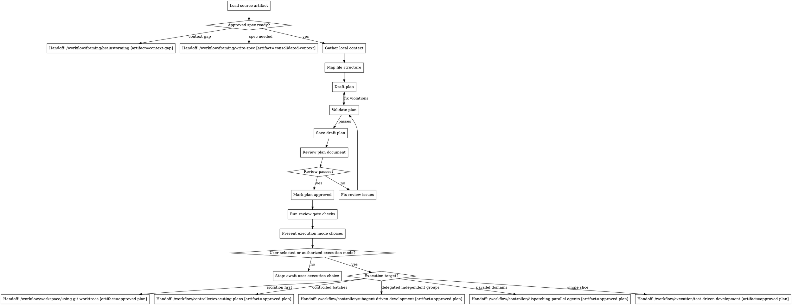

# Write Plan

## Overview

Use this planning workflow to turn an `approved-spec` artifact into an implementation-ready plan.
Treat the plan as the execution contract for the next stage, not as loose brainstorming notes.

This skill runs in Pi, but the underlying planning method is harness-agnostic and should stay reusable across other agent CLIs and orchestrators unless a runtime-specific constraint truly requires otherwise.

This workflow is the natural handoff target for:

`Handoff: /workflow/planning/write-plan [artifact=approved-spec]`

Manual invocation in Pi:

```text
/skill:write-plan
/skill:write-plan /absolute/path/to/spec.md
```

Write prose in the user's language unless the project already uses a fixed documentation language.

Read `references/plan-template.md` when drafting the plan.
Read `references/plan-quality-checks.md` before validating and saving it.
Read `references/plan-review-prompt.md` before presenting a saved plan as approved or ready for execution.
Read `../../../references/w-question-evidence-standard.md` before drafting when the plan is non-trivial, session-derived, autonomous, delegated, review-heavy, or explicitly requires full W-question coverage.

## Hard Gate

Do not implement code in this workflow.

Do not proceed to drafting until:

- the input spec is stable enough to plan against
- scope boundaries are clear enough
- the main design direction is clear enough
- affected files or file groups can be identified
- relevant W-questions are answered or explicitly marked `N/A — reason`
- session, handover, worktree, review, and execution-state evidence is rehydrated when it affects the next safe action
- validation strategy is known

If the available input is still too vague for planning, use `brainstorming` or `write-spec` first.

## When to Use

Use this workflow when:

- an `approved-spec` artifact exists and the next artifact should be an implementation plan
- the change spans multiple files, steps, or verification points
- sequencing, rollback, validation, or commit boundaries need to be explicit before execution
- work should be decomposed into atomic, reviewable tasks

Do not use this workflow for:

- typo-only or obvious one-line fixes
- direct execution where no planning artifact adds safety
- requests that still need framing or spec work first
- post-implementation review or verification

## Quick Gate

- trivial, obvious, one-line -> skip plan
- `approved-spec` + multi-step work -> write plan
- unclear scope or architecture -> `brainstorming` or `write-spec`
- repo already uses `spec -> plan -> tasks` artifacts -> write `plan.md` first and keep later task explosion separate when possible

## Process Flow



## Workflow-Specific Harness

### Load the right source artifact

Use one of these inputs:

- `approved-spec` file

If all you have is a `consolidated-context` artifact, hand it to `write-spec` first rather than planning from it directly.

If the repository already follows a spec-kit-style structure such as `specs/<feature>/spec.md`, use that file as the primary planning input and keep the resulting plan adjacent as `plan.md`.

### Gather local context before decomposition

Use parallel tool calls when operations are independent.

1. Read the nearest relevant instruction files, starting with `AGENTS.md`.
2. Read the input spec document completely.
3. Read repo docs that constrain implementation, testing, architecture, or deployment.
4. Inspect relevant source files, tests, and existing patterns.
5. Inspect recent history with `git log --oneline -20` when implementation style or file ownership patterns matter.
6. Query GraphRAG when prior findings, procedures, or architecture decisions may affect decomposition.
7. Inspect recent session transcripts, handover files, execution-state artifacts, review artifacts, worktree state, and branch state when the user asks to continue prior work, references last-week work, says `fahre fort`, or when the next safe execution state cannot be proven from current files alone.
8. If ports may change, inspect `~/PORTS.md` and include the required update in the plan.

### Session-State and Handover Rehydration Gate

Run this gate before task decomposition when recent work state may affect execution safety:

- identify relevant session JSONL files, handovers, specs, plans, reviews, execution-state artifacts, branches, worktrees, and current filesystem state
- distinguish completed work from planned steps, aborted turns, stale reviews, tool failures, and assumptions
- record the rehydrated state in the saved plan's `Operational State` or `Session Rehydration` section
- if current filesystem state conflicts with session evidence, prefer current filesystem state unless an approved artifact or explicit user instruction says otherwise
- if execution depends on missing or contradictory state, stop and hand back to `write-spec`, `brainstorming`, or `systematic-debugging` instead of guessing

### Map file structure before tasks

Before defining task groups, lock in the file map.

- identify every file to create, modify, test, or validate
- prefer focused file responsibilities
- follow established project structure unless a split is part of the planned change
- keep files that change together close to each other
- do not invent restructuring unless it materially improves the implementation or is already required by the spec

### Make the execution-review contract explicit

Before task decomposition, persist the execution-review contract in the saved plan body or in an explicitly referenced context file so the later review can judge the artifact without relying on chat history:

- plan goal: what implementation outcome the plan must deliver
- source contract: exact `approved-spec` path and the requirements or scenarios that must be covered
- execution scope: exact files, interfaces, config, services, migrations, docs, tests, generated artifacts, and registries in scope
- execution non-scope: boundaries that must not be expanded silently
- dependency order: prerequisites, blocking sequence, and parallel-safe groups
- validation contract: commands, expected outcomes, manual checks, and evidence required before completion claims
- risk classes: failure modes, rollback, data/config/service risks, security, compatibility, performance, and port-registry impacts

Do not hide unresolved execution-contract gaps in assumptions. Either clarify them, mark them as blocking open questions, or hand back to `write-spec` or `brainstorming` when they change scope.

### Plan in atomic execution units

When drafting, read `references/plan-template.md` and use the provided structure.
Apply `../../../references/w-question-evidence-standard.md` proportionally to each non-trivial task group.

For each task group, capture or make locally obvious:

- wer executes or reviews the group
- was changes and what remains out of scope
- wo the exact files and state live
- wie the steps are executed and verified
- womit tools, commands, agents, or MCP surfaces are used
- wovon prerequisites and prior artifacts the group depends on
- wogegen risks, scope drift, and rollback gaps it protects
- warum the sequence is correct
- welche validation and review evidence proves completion

Plan requirements:

- include an execution mode recommendation that distinguishes the controller choice from the TDD discipline
- include an `Autonomy Contract` and explicit stop conditions before any autonomous execution handoff
- organize work into task groups with explicit goals
- list exact file paths for each task group
- include task-level W-question coverage for non-trivial task groups or an explicit reason why it is not applicable
- use `- [ ]` for every action step
- each step should be one action and small enough to execute and review independently
- include exact commands for validation, with expected outcomes where useful
- prefer TDD-style sequencing when the change is testable
- make commit boundaries explicit when commits are part of the workflow
- repeat critical context locally in the relevant task group instead of relying on cross-task memory
- include a spec-coverage map that ties every relevant spec requirement, scenario, or success criterion to one or more task groups
- include a validation-coverage map that ties every meaningful behavior change to a concrete automated or manual check
- mark task groups as sequential or parallel-safe and state file-overlap constraints when delegation may be used
- do not use placeholders such as `TODO`, `TBD`, `similar to above`, or vague phrases like `add validation`

If a repo already separates `plan.md` and `tasks.md`, keep the plan focused on structure, sequencing, constraints, and validation. Do not explode it into giant inline code dumps unless the project explicitly needs that level of prescription.

### Validate, save draft, and review before handoff

Before saving, read `references/plan-quality-checks.md` and run the pre-save checks: Section Checks, Content Checks, and Save Checks.
Fix pre-save violations before saving the draft.

Save the first pre-save-passing version as a draft, then read `references/plan-review-prompt.md` and run a plan-document review against the saved file and the approved spec.
Use an independent reviewer through the current Pi/harness agent or subagent facility when available; otherwise run the prompt as an explicit second-pass self-review and label that limitation in the response.
The reviewer must inspect the saved artifact, not trust the drafting summary.
Persist the review result in the saved plan's `Plan Review Status` section or in an adjacent review artifact linked from that section.

If review returns issues:

- update the plan only for blocking issues that prevent safe execution
- treat non-blocking recommendations as optional notes, not revision triggers
- rerun the pre-save portions of `references/plan-quality-checks.md`
- rerun the plan review until it returns `Status: Approved`
- stop after two unresolved review iterations and report the remaining blockers instead of cycling indefinitely
- if the second review contains only non-blocking recommendations, mark the plan approved with those recommendations recorded

Do not ask for another review pass for non-blocking recommendations.
After any review path returns `Status: Approved`, update the saved plan status from `Draft` to `Approved`, record cumulative blocking issues fixed across all review iterations, and run the Review Gate Checks from `references/plan-quality-checks.md` before execution handoff.
Only then present it as an `approved-plan` at the artifact boundary or hand it to execution when continuation was explicitly authorized.

### Save and hand off explicitly

Save order:

1. user-specified path when the user explicitly requested one
2. sibling `plan.md` next to the input spec when a spec-kit-style feature directory already exists
3. existing repo-local plan directory if one exists
4. repo-local `plans/`
5. repo-local `docs/plans/`

If the user-specified path conflicts with an established repo planning convention, clarify before saving or document the reason for the deviation in the response.
If no naming convention exists, use:

```text
YYYY-MM-DD-{topic}-implementation-plan.md
```

After saving and passing plan review, present explicit execution mode choices instead of silently defaulting to one route.
If the user already gave unambiguous execution authorization such as "use your recommended execution mode", "execute this plan autonomously", "autonom den Plan abarbeiten", "work autonomously", "YOLO mode", or equivalent, choose the safest recommended execution mode and hand off immediately instead of asking a separate execution-mode question.
TDD is the mandatory implementation discipline inside each mode when behavior is testable; it is not mutually exclusive with delegated or parallel execution.

Present this choice set:

1. **Direct TDD single-slice** -> `Handoff: /workflow/execution/test-driven-development [artifact=approved-plan]`
   - Use when the next step is one small implementation slice.
2. **Controlled inline execution** -> `Handoff: /workflow/controller/executing-plans [artifact=approved-plan]`
   - Use when task groups are sequential or tightly coordinated; each behavior-changing slice uses TDD.
3. **Subagent-driven development** -> `Handoff: /workflow/controller/subagent-driven-development [artifact=approved-plan]`
   - Use when task groups are mostly independent but require task-by-task reintegration and review; each worker uses TDD for behavior-changing slices.
4. **Parallel agent development** -> `Handoff: /workflow/controller/dispatching-parallel-agents [artifact=approved-plan]`
   - Use when domains are truly independent, have no unstable file overlap, and can be verified separately before combined verification; each worker uses TDD for behavior-changing slices.
5. **Isolated workspace first** -> `Handoff: /workflow/workspace/using-git-worktrees [artifact=approved-plan]`
   - Use before any execution mode when the current workspace is dirty, shared, or unsafe.

Final response must include: saved plan path, review status, reviewer type (`independent` or `second-pass self-review`), cumulative blocking issues fixed count, recommended execution mode, all available execution choices, and next handoff only when the user already selected or explicitly authorized a mode. If autonomous execution was authorized, keep the response minimal and proceed into the handoff instead of waiting for confirmation.

## Active Handoff Guidance

- requirements too vague -> `Handoff: /workflow/framing/brainstorming [artifact=context-gap]`
- spec still needed -> `Handoff: /workflow/framing/write-spec [artifact=consolidated-context]`
- single small implementation slice -> `Handoff: /workflow/execution/test-driven-development [artifact=approved-plan]`
- sequential or tightly coordinated multi-task plan -> `Handoff: /workflow/controller/executing-plans [artifact=approved-plan]`, with TDD inside behavior-changing slices
- mostly independent task groups needing delegated workers and per-task reintegration -> `Handoff: /workflow/controller/subagent-driven-development [artifact=approved-plan]`, with TDD inside behavior-changing worker slices
- truly independent domains worth parallel tracks -> `Handoff: /workflow/controller/dispatching-parallel-agents [artifact=approved-plan]`, with TDD inside behavior-changing worker slices
- dirty, shared, or unsafe workspace -> `Handoff: /workflow/workspace/using-git-worktrees [artifact=approved-plan]` before selecting the execution mode
- bugfix or failing path with unclear root cause -> `Handoff: /workflow/debugging/systematic-debugging [artifact=unclear-failure]`
- prior internal knowledge needed -> `Invoke skill: graphrag-research [artifact=knowledge-gap]`
- current external discovery needed -> `Invoke skill: dg-webresearch [artifact=discovery-gap]`
- evidence-based multi-source comparison needed -> `Invoke skill: deep-research [artifact=evidence-gap]`
- browser-only source needed -> `Invoke skill: browser-research [artifact=browser-gap]`
- durable reusable findings should be remembered -> `Invoke skill: graphrag-memory [artifact=reusable-finding]`

## Related Quality and Lifecycle Gates

These are not alternative plan-writing outputs. They run later alongside or after the selected execution workflow:

- `verification-before-completion` via `/workflow/quality/verification-before-completion` for evidence-before-claims at every completion boundary
- `requesting-code-review` via `/workflow/quality/requesting-code-review` after meaningful implementation slices or before merge
- `finishing-a-development-branch` via `/workflow/completion/finishing-a-development-branch` only after implementation, verification, and review are complete

Workspace and controller choices such as `using-git-worktrees`, `executing-plans`, `subagent-driven-development`, and `dispatching-parallel-agents` are active execution handoff targets and are modeled in the DOT above.

## Handoff Rule

This DOT is the normative handoff source for this workflow.

Every automated handoff must name a concrete installed workflow path and a concrete artifact name, for example:

- `Handoff: /workflow/framing/write-spec [artifact=consolidated-context]`
- `Handoff: /workflow/controller/executing-plans [artifact=approved-plan]`

Do not emit placeholder handoff targets. Select one of the concrete installed workflow paths modeled in the DOT or add an explicit new installed workflow path before using it.
Do not replace handoffs with vague prose.
