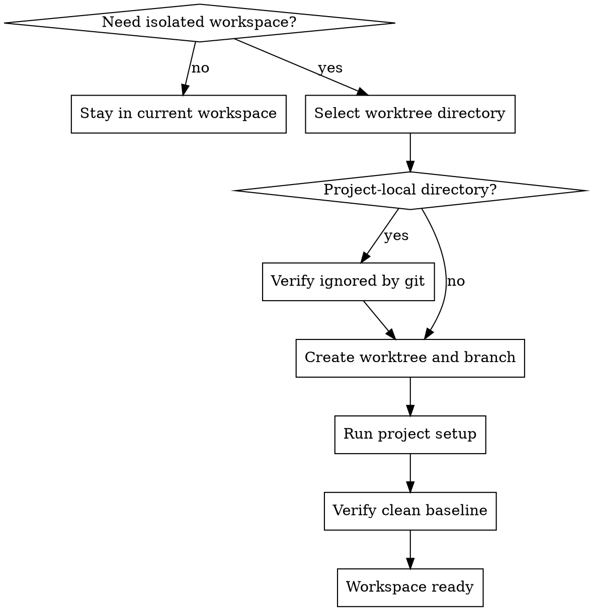

# Using Git Worktrees

## W-Question, Evidence, and Handoff Gate

When this workflow creates, reviews, executes, verifies, delegates, completes, or hands off durable work, apply `../../../references/w-question-evidence-standard.md` proportionally before the next irreversible or hard-to-review step. Capture the relevant wer, was, wann, wo, wie, womit, wovon, wogegen, warum/wieso/weshalb, and welche evidence in the saved artifact, review, checkpoint, or final report.

Use an Evidence Ledger, Session Evidence, Decision Ledger, Autonomy Contract, Stop Conditions, and Validation Evidence when prior sessions, handovers, reviews, branches, worktrees, tools, or autonomous continuation affect safety. Stop or hand back when a required source artifact is missing, review state is stale, validation cannot prove the claim, scope or authority would expand, or the next workflow step would rely on hidden chat context.


## Overview

Create an isolated workspace before non-trivial execution when the current checkout is not the safest place to work.

This is a workspace-preparation workflow. Use it before implementation controllers or direct execution when branch isolation, clean baselines, or separation from unrelated local changes matters.

## Hard Gate

Do not begin non-trivial execution in a dirty or shared workspace when isolation is the safer option.

For project-local worktree directories, do not create the worktree until the directory is confirmed ignored by git.

## When to Use

Use this workflow when:

- feature work is about to start on a dirty branch
- unrelated local changes exist and should not mix with the planned work
- a written implementation plan is about to be executed in isolation
- multiple branches or workstreams must coexist safely
- rollback boundaries are clearer with a separate worktree

Do not use this workflow when:

- the task is truly trivial and isolation adds no safety
- the current branch and workspace are already the explicit intended execution surface

## Process Flow



## Directory Selection Order

Choose the worktree location in this priority order:

1. existing `.worktrees/` in the repo root
2. existing `worktrees/` in the repo root
3. explicit preference documented in `AGENTS.md`
4. ask the user to choose between:
   - `.worktrees/`
   - `~/worktrees/<project-name>/`

If both `.worktrees/` and `worktrees/` exist, prefer `.worktrees/`.

## Workflow-Specific Harness

### Verify ignore safety for project-local directories

If the chosen location is project-local:

- check that the directory is ignored by git before creating the worktree
- if it is not ignored, add the ignore entry before proceeding
- do not assume it is safe just because the directory name looks conventional

This prevents worktree contents from polluting repository status.

### Create the worktree

- detect the repo root and project name
- derive a clear branch name from the task or feature
- create the new branch with `git worktree add`
- switch execution context to the new worktree path

### Run project setup

Auto-detect the basic setup needed by the repo, for example:

- `package.json` -> install node dependencies
- `Cargo.toml` -> fetch or build rust dependencies
- `requirements.txt` or `pyproject.toml` -> install python dependencies
- `go.mod` -> download go dependencies

### Verify the baseline before implementation

Run the project-appropriate baseline verification so new failures are distinguishable from pre-existing ones.

If the baseline is already failing:

- report that clearly
- ask whether to proceed in spite of the failing baseline or investigate first

## Rationalizations

| Excuse | Reality |
|--------|---------|
| "I can just be careful in the dirty workspace." | Caution is weaker than isolation when unrelated changes already exist. |
| "Creating a worktree is overhead." | Isolation is cheaper than accidental overlap, staging confusion, or rollback pain. |
| "The directory name looks standard, so it is probably ignored." | Probably is not evidence. Verify ignore status first. |
| "I can start now and isolate later if it gets messy." | Isolation is most valuable before execution starts. |

## Red Flags

- beginning feature work on a dirty shared branch without evaluating isolation
- creating a project-local worktree without ignore verification
- skipping baseline verification in the new worktree
- hardcoding setup steps without checking repo tooling
- assuming a global or project-local directory without checking repo conventions

All of these mean: stop and restore the workspace-preparation flow.

## Parallel Use

Use this before active execution workflows when isolation is needed, especially:

- before `/workflow/execution/test-driven-development` for non-trivial implementation in a dirty repo
- before `/workflow/controller/executing-plans` when a multi-task plan should run in isolation
- before `/workflow/controller/subagent-driven-development` when delegated task slices should run in isolation
- alongside `/workflow/completion/finishing-a-development-branch` later if cleanup of a dedicated worktree becomes relevant

This workflow prepares the execution surface. It is not itself a coding, debugging, or review workflow.

## Final Rule

```text
Isolation decisions belong before execution, not after the workspace is already mixed.
```
