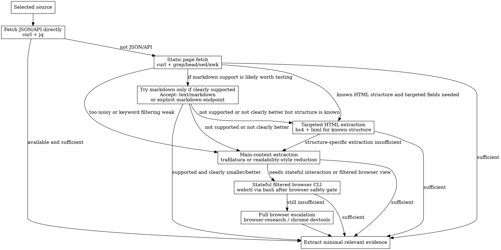

# Deep Research

## W-Question and Provenance Gate

Before turning discovery into research conclusions, apply `../../portable/references/w-question-evidence-standard.md` proportionally. Use the W-questions to define who needs the answer, what claim is being tested, when current information matters, where sources came from, how they were fetched, which tools were used, what prior artifacts the answer depends on, what risk the research prevents, why selected sources are credible, and which evidence supports each claim.

Maintain a provenance ledger for sources, retrieval dates, extraction methods, source quality, limitations, and discarded candidates when they affect the conclusion. Distinguish quick discovery from evidence-grade synthesis. Stop or downgrade confidence when authoritative sources cannot be fetched, browser extraction is incomplete, sources disagree without resolution, or the next workflow would depend on unverified claims.


## Overview

Use this skill for CLI-first, multi-source research. It starts after discovery and focuses on collecting evidence, comparing sources, and synthesizing a grounded research output.

Use the resulting findings as input to `brainstorming` or `write-spec`. This skill is not a replacement for the `brainstorming -> write-spec -> write-plan` chain.

This skill is the domain-agnostic `deep-research` mode:

- discovery pool: up to **20** candidates total
- final synthesis set: the **best 6** sources after filtering and deduplication

Use `dg-webresearch` for initial discovery.
Use `browser-research` only when cheaper fetch and filtering paths cannot reliably expose the needed content.

## When to Use

- two or more sources must be compared
- a claim must be checked against multiple sources
- the answer needs evidence, not just one quick lookup
- conflicting source statements must be reconciled
- the topic is too broad for `research` but does not require the full `deepdeepresearch` mode

Do not use this skill for initial search discovery, browser-first workflows, or frontend debugging.

De-escalate to `dg-webresearch` or a single-source lookup when discovery shows the answer is narrow, low-risk, and answered by one authoritative source. Escalate to `deepdeepresearch` only when the topic is broad, contested, high-stakes, or needs perspective balancing beyond six sources.

## Core Workflow

1. Start from known candidate sources or do a focused `dg` discovery run when `dg` is available. If `dg` is unavailable and no candidates are already known, use another explicitly available discovery tool and record it, or stop with a discovery blocker instead of looping between research skills.
2. Build a candidate pool of up to **20** discovery results total, usually across 2-3 focused queries instead of one broad query.
3. Deduplicate and remove low-quality or redundant results.
4. Select the **best 6** sources for evidence extraction.
5. Fetch the selected sources using the benchmark-informed token-efficient hierarchy below.
6. Extract only the evidence needed for the question.
7. Build a source ledger and claim-to-source map before synthesis.
8. Compare claims across sources, including conflicts, recency, and reliability.
9. Write the research output around evidence, not around memory.
10. Escalate to `browser-research` only if a selected source depends on JavaScript or hidden DOM state and cheaper fetch paths failed.

## Fetch and Filtering Hierarchy

Use the cheapest viable fetch path first. Benchmark findings currently favor **static-first** over unconditional markdown-first. Treat markdown as an opportunistic fast path, not as the default winner.



## Preferred Tools

- `dg` for additional source discovery
- `curl` for direct page fetches
- `gh` for repository, issue, PR, and release material
- `jq` for structured reduction of JSON and APIs
- `grep`, `head`, `sed`, `awk` for lightweight prefiltering
- `bs4` with `lxml` via Python for targeted HTML extraction when the page structure is known
- `trafilatura` CLI for main-content extraction and markdown/text conversion
- `webctl` via `bash` for stateful filtered browser interaction only after passing the Browser Safety Gate from `browser-research` and recording browser-style provenance
- `bash` for orchestration and lightweight filtering

## CLI Patterns

Fetch JSON/API directly first when available:

```bash
curl -s "https://example.com/api" | jq .
```

Fetch a static page and prefilter aggressively:

```bash
curl -L "https://example.com" | grep -iE 'keyword1|keyword2' | head -n 40
```

Reduce raw HTML before inspection:

```bash
curl -L "https://example.com" | sed 's/<[^>]*>/ /g' | tr -s ' '
```

Try markdown when the site clearly supports it or the endpoint advertises it:

```bash
curl -L -H "Accept: text/markdown" "https://example.com"
```

Prefer the markdown result only if it is actually cleaner/smaller than the static fetch.

Use `bs4` only for targeted, structure-aware extraction:

```bash
python - <<'PY'
from bs4 import BeautifulSoup
import requests
html = requests.get('https://example.com').text
soup = BeautifulSoup(html, 'lxml')
print(soup.title.get_text(strip=True))
PY
```

Use `bs4` for known fields like title, meta tags, tables, link lists, or specific containers — not as the generic default for main-content extraction.

Extract readable main content when HTML is still too noisy:

```bash
trafilatura -u "https://example.com/article" --markdown
curl -L "https://example.com/article" | trafilatura --markdown
```

Use filtered browser CLI when stateful interaction is needed but full devtools escalation is avoidable. Before any `webctl` command, apply the Browser Safety Gate from `browser-research` and record browser-style provenance:

```bash
webctl navigate "https://example.com"
webctl snapshot --interactive-only --limit 30
webctl snapshot --within "role=main"
webctl snapshot | grep -i "keyword"
```

Fetch GitHub release metadata:

```bash
gh api repos/OWNER/REPO/releases/latest
```

Fetch a README or docs file from GitHub:

```bash
gh api repos/OWNER/REPO/readme -H "Accept: application/vnd.github.raw+json"
```

Use structured search results for deep-research discovery:

```bash
dg -j -n 8 "query"
```

Run multiple focused queries until the combined candidate pool reaches the needed breadth, but cap the total pool at 20 before synthesis.

## Provenance and Synthesis Gates

Before presenting findings, create a source ledger for every synthesis source:

- title
- URL
- source type
- retrieval date or current session date
- extraction method, such as API, static fetch, markdown, targeted HTML, readable extraction, webctl, or browser
- exact quote, fragment, or data point used
- reliability assessment and limitations

Then build a claim-to-source map:

- every substantive claim must cite at least one ledger entry
- important or risky claims should have two independent sources when available
- conflicts must be shown in a conflict table or explicit bullet list
- time-sensitive claims must include source dates or note that recency could not be verified
- if evidence is insufficient, say `insufficient evidence` instead of filling gaps from memory

Keep the final research output evidence-based, explicit about conflicts, and clear about uncertainty. Do not synthesize all 20 discovery candidates; synthesize only the filtered final set of 6 sources. For the detailed comparison and synthesis patterns, see `references/synthesis.md`.

## Common Mistakes

- using one source when the question needs cross-checking
- treating all discovery candidates as synthesis sources instead of filtering to the best 6
- sending raw full-page HTML to the model when JSON, curl-prefiltering, markdown, targeted `bs4`, or readable extraction would suffice
- assuming markdown-first is always better without checking whether the source really supports markdown well
- using `bs4` as a generic main-content extractor instead of a targeted structure-aware extractor
- summarizing before evidence has been extracted
- making uncited synthesis claims
- treating issue comments like official documentation
- escalating to browser tooling before trying JSON, static prefiltering, markdown opportunistically, or main-content extraction

## Environment Notes

- this is a CLI-first skill
- discovery for this mode is capped at 20 candidates
- final synthesis for this mode is capped at 6 sources
- benchmark findings currently favor `optimized_static_first` as the best general default path
- in this environment, prefer JSON/API, then static `curl` prefiltering, then markdown only when clearly supported, then targeted `bs4` when structure is known, then `trafilatura`, then `webctl`, then full browser escalation
- `bs4` and `lxml` are installed and available for targeted HTML extraction
- `trafilatura` CLI is installed and available for readable content extraction
- `webctl` CLI is installed and available for stateful filtered browser interaction, but it still requires the Browser Safety Gate from `browser-research`
- keep browser use as an escalation path, not the default
