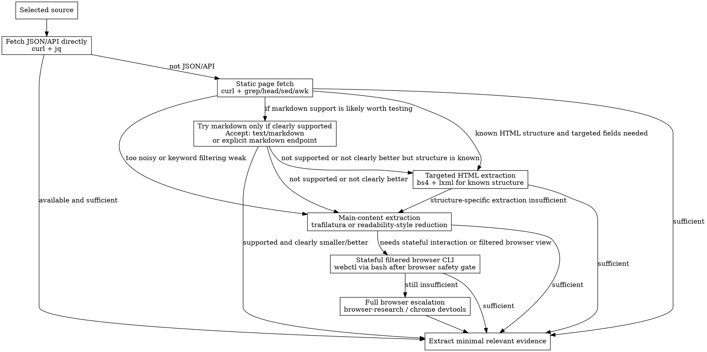

# Deep Deep Research

## W-Question and Provenance Gate

Before turning discovery into research conclusions, apply `../../portable/references/w-question-evidence-standard.md` proportionally. Use the W-questions to define who needs the answer, what claim is being tested, when current information matters, where sources came from, how they were fetched, which tools were used, what prior artifacts the answer depends on, what risk the research prevents, why selected sources are credible, and which evidence supports each claim.

Maintain a provenance ledger for sources, retrieval dates, extraction methods, source quality, limitations, and discarded candidates when they affect the conclusion. Distinguish quick discovery from evidence-grade synthesis. Stop or downgrade confidence when authoritative sources cannot be fetched, browser extraction is incomplete, sources disagree without resolution, or the next workflow would depend on unverified claims.


## Overview

Use this skill for the broadest research mode when ordinary deep research is not enough. This is a domain-agnostic workflow for wide discovery, hard filtering, perspective balancing, and final synthesis.

Use the resulting findings as input to `brainstorming` or `write-spec`. This skill is not a replacement for the `brainstorming -> write-spec -> write-plan` chain.

This skill is the `deepdeepresearch` mode:

- discovery pool: up to **50** candidates total
- final synthesis set: the **best 10** sources after filtering, deduplication, and perspective balancing
- perspective requirement: final sources should cover at least **4 distinct perspective types** when the topic allows it

Use `dg-webresearch` for discovery.
Use `deep-research` when 20 candidates and 6 synthesis sources are enough.
Use `browser-research` only for pages that require DOM or JavaScript interaction after cheaper fetch paths fail.

## When to Use

- the topic is broad, contested, or high-stakes
- multiple viewpoints must be represented, not just verified
- official sources alone are insufficient
- contradictory evidence must be mapped, not merely mentioned
- the user wants the most robust research mode rather than a fast answer

Do not use this skill for simple fact lookups, narrow API questions, obvious single-source answers, or ordinary two-source comparisons.

De-escalate to `deep-research`, `dg-webresearch`, or a single authoritative source when discovery shows the topic is narrow, duplicate-heavy, low-stakes, or adequately answered without broad perspective balancing.

## Core Workflow

1. Start with `dg` discovery when `dg` is available. If `dg` is unavailable and no candidates are already known, use another explicitly available discovery tool and record it, or stop with a discovery blocker instead of looping between research skills.
2. Build a combined candidate pool of up to **50** results total, usually across multiple focused queries.
3. Remove duplicates, mirrors, low-quality aggregators, and near-duplicates.
4. Cluster the remaining candidates by perspective type.
5. Select the **best 10** sources for synthesis.
6. Ensure the final set covers at least **4 perspective types** when the topic allows it.
7. If fewer than 10 high-quality sources or fewer than 4 perspective types exist, record that limitation instead of padding with weak sources.
8. Fetch the selected sources using the benchmark-informed token-efficient hierarchy below.
9. Extract only the evidence needed.
10. Build a source ledger and claim-to-source map before synthesis.
11. Synthesize around agreements, disagreements, gaps, assumptions, and uncertainty.
12. Escalate to `browser-research` only when selected sources require browser-only extraction and cheaper paths failed.

## Fetch and Filtering Hierarchy

Use the cheapest viable fetch path first. Benchmark findings currently favor **static-first** over unconditional markdown-first. Treat markdown as an opportunistic fast path, not as the default winner.



## Perspective Types

Use these domain-agnostic perspective types to diversify the final 10 sources:

1. **Primary / original source**
   - official source, original document, original statement, source-of-record
2. **Empirical / operational source**
   - measurements, field reports, reproductions, observed behavior, case reports, datasets
3. **Secondary analysis**
   - expert analysis, technical interpretation, review, comparative article, synthesis by a third party
4. **Counter-evidence / dissent**
   - criticism, failed reproduction, minority position, contradictory analysis, rebuttal
5. **Context / background source**
   - standards, historical framing, definitions, reference material, ecosystem context
6. **Applied / practitioner source**
   - implementation notes, deployment reports, user/operator experience, real-world usage

Not every topic will supply every type. Use the broadest feasible spread without forcing bad sources into the final set.

## Preferred Tools

- `dg` for discovery and candidate expansion
- `curl` for direct page fetches
- `gh` for repository, issue, PR, and release material
- `jq` for structured reduction of JSON and APIs
- `grep`, `head`, `sed`, `awk` for lightweight prefiltering
- `bs4` with `lxml` via Python for targeted HTML extraction when the page structure is known
- `trafilatura` CLI for main-content extraction and markdown/text conversion
- `webctl` via `bash` for stateful filtered browser interaction only after passing the Browser Safety Gate from `browser-research` and recording browser-style provenance
- `bash` for orchestration and deduplication

## Discovery Patterns

Broad first pass:

```bash
dg -j -n 10 "query"
```

Perspective-focused follow-up examples:

```bash
dg -j -n 10 "query official"
dg -j -n 10 "query analysis"
dg -j -n 10 "query criticism"
dg -j -n 10 "query case study"
dg -j -n 10 "query issue report"
```

Do not exceed a combined pool of 50 candidates before filtering.

## Selection Rules

The final 10 sources should be chosen by:

1. source quality
2. direct relevance
3. uniqueness of evidence
4. perspective coverage
5. recency when the topic is time-sensitive

Avoid selecting 10 sources that all repeat the same viewpoint.

## CLI Patterns

Fetch JSON/API directly first when available:

```bash
curl -s "https://example.com/api" | jq .
```

Prefilter static pages:

```bash
curl -L "https://example.com" | grep -iE 'keyword1|keyword2' | head -n 60
```

Try markdown when the site clearly supports it or the endpoint advertises it:

```bash
curl -L -H "Accept: text/markdown" "https://example.com"
```

Prefer the markdown result only if it is actually cleaner/smaller than the static fetch.

Use `bs4` only for targeted, structure-aware extraction:

```bash
python - <<'PY'
from bs4 import BeautifulSoup
import requests
html = requests.get('https://example.com').text
soup = BeautifulSoup(html, 'lxml')
print(soup.title.get_text(strip=True))
PY
```

Use `bs4` for known fields like title, meta tags, tables, link lists, or specific containers — not as the generic default for main-content extraction.

Readable main-content extraction:

```bash
trafilatura -u "https://example.com/article" --markdown
curl -L "https://example.com/article" | trafilatura --markdown
```

Filtered browser CLI. Before any `webctl` command, apply the Browser Safety Gate from `browser-research` and record browser-style provenance:

```bash
webctl navigate "https://example.com"
webctl snapshot --interactive-only --limit 30
webctl snapshot --within "role=main"
webctl snapshot | grep -i "keyword"
```

## Provenance and Synthesis Gates

Before presenting findings, create a source ledger for every synthesis source:

- title
- URL
- source type and perspective type
- retrieval date or current session date
- extraction method, such as API, static fetch, markdown, targeted HTML, readable extraction, webctl, or browser
- exact quote, fragment, or data point used
- reliability assessment and limitations

Then build a claim-to-source map:

- every substantive claim must cite at least one ledger entry
- important or risky claims should have two independent sources when available
- conflicts must be shown in a conflict table or explicit bullet list
- time-sensitive claims must include source dates or note that recency could not be verified
- if evidence is insufficient, say `insufficient evidence` instead of filling gaps from memory

## Synthesis Rules

The final research output should:

- distinguish consensus from disagreement
- show where evidence is strong vs weak
- identify what remains unresolved
- avoid overweighting official sources when empirical evidence contradicts them
- avoid overweighting anecdotal sources when primary evidence is available
- stay domain-agnostic in structure and language unless the task itself requires domain-specific framing
- synthesize only the final selected sources, never the full 50-candidate pool
- state when fewer than 10 strong final sources or fewer than 4 perspective types were available

## Common Mistakes

- treating 50 candidates as 50 synthesis sources
- choosing 10 near-duplicate links from the same perspective
- sending raw full-page HTML to the model when JSON, static filtering, markdown, targeted `bs4`, or readable extraction would suffice
- assuming markdown-first is always better without checking whether the source really supports markdown well
- using `bs4` as a generic main-content extractor instead of a targeted structure-aware extractor
- overfitting the workflow to software or coding topics
- mixing discovery and synthesis without a reduction step
- using browser tooling before the final source set is selected and cheaper fetch paths have been tried
- making uncited synthesis claims

## Environment Notes

- this is a CLI-first skill
- use `dg` first and keep discovery local to the degoog-backed CLI path
- discovery is capped at 50 candidates
- synthesis is capped at 10 final sources
- perspective diversity is required when the available evidence allows it
- benchmark findings currently favor `optimized_static_first` as the best general default path
- in this environment, prefer JSON/API, then static `curl` prefiltering, then markdown only when clearly supported, then targeted `bs4` when structure is known, then `trafilatura`, then `webctl`, then full browser escalation
- `bs4` and `lxml` are installed and available for targeted HTML extraction
- `trafilatura` CLI is installed and available for readable content extraction
- `webctl` CLI is installed and available for stateful filtered browser interaction, but it still requires the Browser Safety Gate from `browser-research`
